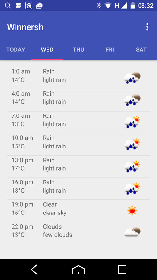

# buildit-exercise (MyWeather)
This sample application takes your last known location and presents a 5 day forecast. The weather data is retrieved from [OpenWeatherMap 5 day weather forecast API](http://openweathermap.org/forecast5). The forecast is presented as tabbed page views by day. Each day fragment contains a list of weather conditions by time.



## Installation

Clone the repository and import the project into Android Studio. There are no special steps required to run the project. 

You can run the application in 'local' mode. In this mode the application will load weather data from a local fixture file rather than attempt to download data online. To set this mode, change the value of `UseLocalFixture` to `true` in the file:
`app/src/main/java/com/example/charliemyers/myweather/Config.java`

```java
public class Config {
    public static final boolean UseLocalFixture = true;
}
```

## Enhancements

### Testing
_Todo_

### Fixes and Technical Debt
* Getting the geo-location went in late. With more time I'd certainly implement this differently. For starters, I only call this once on creation and just to get the last known location. It should actively request the current location and handle location updates.
* The way I load data is inefficient and would need to be refactored. Each page fragment loads all the data each time the view is created. The data should only be loaded once and held centrally. The data only needs to be updated on a change in geo-location or periodically to ensure it does not go out of date.
* Rather than constantly pull icons from the service I've made a local copy of the images. No attempt has been made to handle different screen sizes or resolutions. 
* The application makes no attempt to cache any data. This would need to be added. For this application, data goes out of date very quickly and therefore has a relatively short window of usefulness.
* The JSON entries from the weather API actually support more than one weather type for a 3 hour period. For simplicity I'm just using the first entry.
* You'll notice that the last entry in the list views is not displayed properly (particularly in landscape). This is because I'm not hiding the action bar as I scroll down. It's something I haven't got round to implementing or fixing.

### New Features
I was planning to have a dashboard page that allowed the user to get the weather at 4 locations:
* The current geo-location (what we have)
* At home (home location selected by the user)
* At next holiday destination (selected by the user)
* At the next fixture (I was going to use the API at _http://api.football-data.org_ to get the next Chelsea fixture location)

Most of the groundwork is in place but I sadly ran out of time.

Features, however, need to be based on your target users. Who are you aiming the application at? Some example target audiences might be:
* Sailors and boat owners. You'd probably look to change the input source to one that provided shipping forecasts rather than general weather. The app may also focus on weather warnings for the location(s) your boat/ship/fleet is moored or common routes. 
* Golfers. Location selection may be by golf course rather than selecting specific places or geo-locations.
* Outdoor event organizers. Query the calendar for the next 5 days and pull out all the events that have an associated location. You could then show the forecast for the given location for the time of the event.
 
### Accuracy
If accuracy is important you could gather weather data from more than one provider and use an average rather than relying on one data source. You could further enhance this by collecting the current actual temperatures, rainfall figures, etc. With this you have both the weather predictions and data on what actually happened. This allows you to weight the averaging calculation towards those data sources that have historically been most accurate. This may differ from location to location. The Hong Kong met office may be fabulous at providing weather conditions in Beijing but useless for predicting anything in Moscow.

### Analytics
To get the best from the application, you'll want to know how your application is working once it hits actual end users. There are free analytics tools such as Google Analytics and Flurry or commercial tools such as Localitics and Amplitude (amongst many others). Tools like these allow you to do A/B testing, examine user flows and drop out points, etc. 

### Maps
OpenWeatherMap provide a number of weather maps. I'd like to add and animating map forecast similar to sites such as BBC weather. Looking through the docs, the maps appear to be current weather only so I would probably need to get weather maps from a different source.

